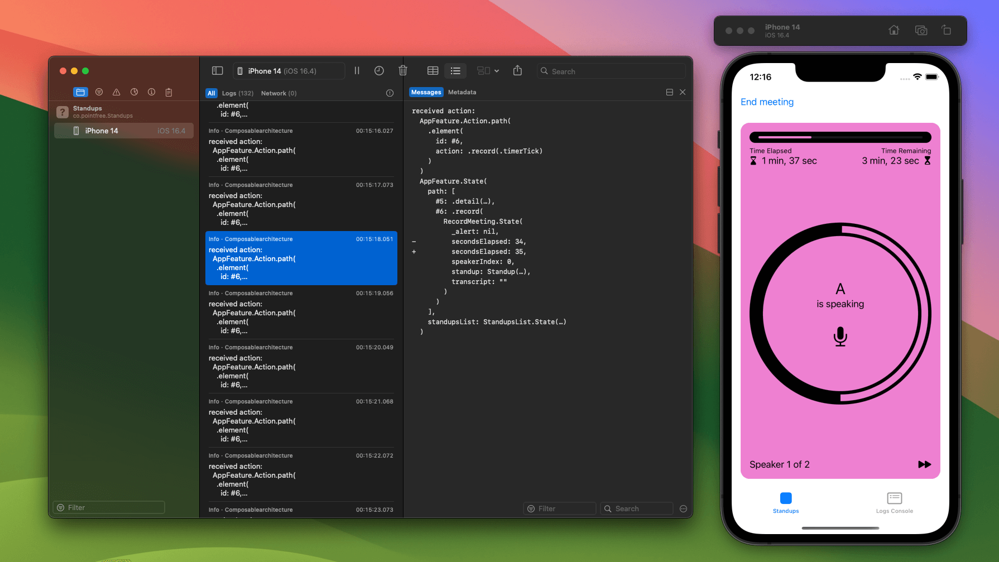
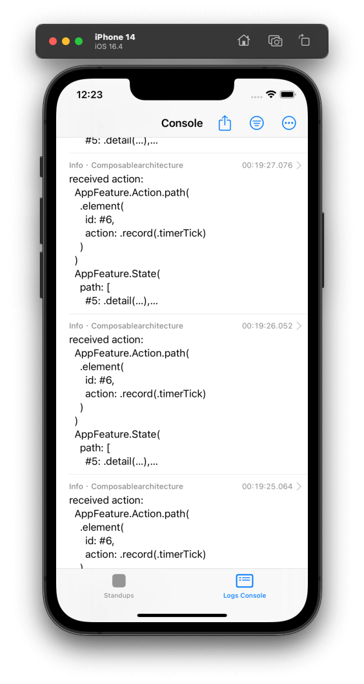

# ComposableArchitecture + SwiftLog


Log actions and state changes in [ComposableArchitecture](https://github.com/pointfreeco/swift-composable-architecture) applications using [SwiftLog](https://github.com/apple/swift-log) library.

## 📖 Usage

Use [Swift Package Manager](https://swift.org/package-manager/) to add the `TCASwiftLog` library as a dependency to your project. 

Use `_ReducerPrinter.swiftLog` on your reducer to log actions and state mutations:

```swift
import TCASwiftLog

let store = Store(initialState: AppFeature.State()) {
  AppFeature()._printChanges(.swiftLog(label: "tca"))
}
```

### ▶️ Example

This repository contains an example iOS application from ComposableArchitecture repository - [Standups](Examples/Standups).

- Open `TCASwiftLog.xcworkspace` in Xcode.
- Run the example app using `Standups` build scheme.
- "Standups" tab contains UI of the example app.
- "Logs Console" tab contains [PulseUI](https://kean-docs.github.io/pulseui/documentation/pulseui/) logs console.

The example app uses [Pulse](https://github.com/kean/Pulse) as a logging system's log handler. It also integrates UI for logs console. Remote logging can be enabled in the console settings.




## 🏛 Project structure

```
TCASwiftLog (Xcode Workspace)
 ├─ tca-swift-log (Swift Package)
 |   └─ TCASwiftLog (Library)
 └─ Standups (Xcode Project)
     └─ Standups (Example iOS Application)
```

## 🛠 Develop

- Use Xcode (version ≥ 14.3.1).
- Clone the repository or create a fork & clone it.
- Open `TCASwiftLog.xcworkspace` in Xcode.
- Use the `TCASwiftLog` scheme for building the library and running unit tests.
- If you want to contribute, create a pull request containing your changes or bug fixes. Make sure to include tests for new/updated code.

## ☕️ Do you like the project?

<a href="https://www.buymeacoffee.com/darrarski" target="_blank"></a>

## 📄 License

Copyright © 2023 Dariusz Rybicki Darrarski

License: [MIT](LICENSE)
